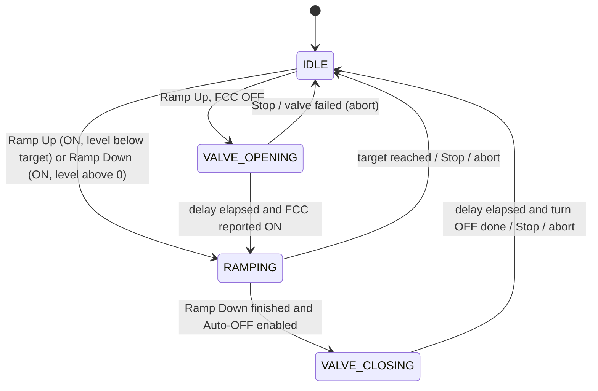

# Architecture: FCC Ramp

Terminology: **FCC level (%)** = SmartSEM `AP_CC_PRESSURE` (0-100).

## 1. Component Overview
```
ChargeCompensatorDlg  --(start/stop, reads status)-->  SEM_SmartSEM (ramp state machine, Qt-free)
FccRampSettingsDlg    --(edits settings)---------->  SEM_SmartSEM.fcc_ramp_* settings (-> [sem] in default.ini)
MainControls          --(1 s QTimer: fcc_ramp_tick(), repaint FCC button, show messages)--> SEM_SmartSEM
```
- The ramp lives in `SEM_SmartSEM` (`src/sem_control_zeiss.py`). It is Qt-free and built only on existing primitives: `is_fcc_on`, `get_fcc_level`, `set_fcc_level`, `turn_fcc_on`, `turn_fcc_off`.
- Base class `SEM` (`sem_control.py`) exposes the same API as no-op stubs. `SEM_Mock` has a thin implementation for simulation/tests. MultiSEM / Tescan: stubs only (button stays disabled via `has_fcc()`).
- Because the dialog is created per open (`dialog.exec_()`) and destroyed on close, all ramp state is kept in the SEM object, never in the dialog.

## 2. Public API on the SEM object
| Member | Description |
|---|---|
| `fcc_ramp_target`, `fcc_ramp_duration_min`, `fcc_ramp_valve_delay`, `fcc_ramp_auto_off` | Settings (loaded from / saved to `[sem]`) |
| `start_fcc_ramp_up()` -> `(started: bool, message: str)` | Validates with fresh readbacks and starts, or refuses with a message |
| `start_fcc_ramp_down()` -> `(started: bool, message: str)` | Same, target 0% |
| `stop_fcc_ramp()` | Stops in any state; no hardware command is issued |
| `fcc_ramp_tick(now=None)` | Advances the state machine. `now` defaults to `time.monotonic()` (injectable for tests). No-op until `FCC_RAMP_TICK_S` (5 s) has elapsed since the last tick; the first tick runs at start. |
| `fcc_ramp_status` | `(state, direction, progress 0..1, target, event, message)`; `event` is one of `None`, `FINISHED`, `ABORTED_EXTERNAL`, `ABORTED_ERROR`, `AUTO_OFF_FAILED`, `STOPPED` |

Constants on `SEM_SmartSEM`: `FCC_RAMP_TICK_S = 5`, `FCC_LEVEL_STEP = 0.1` (SmartSEM granularity), `FCC_RAMP_TOLERANCE = 1.0` (%; interference and readback tolerance; to be tuned on the microscope).

## 3. State Machine
States: `IDLE`, `VALVE_OPENING`, `RAMPING`, `VALVE_CLOSING`.



### Start rules (fresh `is_fcc_on()` and `get_fcc_level()` at click time)
- **Ramp Up, FCC OFF:** `set_fcc_level(0)` -> `turn_fcc_on()` -> read back level; if not ~0 (step 0.1), `set_fcc_level(0)` again (fallback). Enter `VALVE_OPENING` with deadline `now + valve_delay`.
- **Ramp Up, FCC ON, level < target:** `start_level` = fresh level; enter `RAMPING` directly (no valve wait, no reset to 0).
- **Ramp Up, FCC ON, level >= target:** refuse, message "already at or above target". Nothing is started.
- **Ramp Down, FCC ON, level > 0:** `start_level` = fresh level; target 0; enter `RAMPING`.
- **Ramp Down, FCC ON, level == 0:** refuse, message "already at 0%".
- **Ramp Down, FCC OFF:** button is disabled (nothing to ramp).
- A Ramp Down never changes `fcc_ramp_target`.

### Tick behaviour (every 5 s)
- `VALVE_OPENING`: wait until the deadline, then verify `is_fcc_on()`. If ON -> `RAMPING` with `start_level = 0`, `start_time = now`. Otherwise abort (valve failed).
- `RAMPING`:
  1. Read back `actual = get_fcc_level()` and `is_fcc_on()`.
  2. If `actual` is not numeric -> `ABORTED_ERROR`. If FCC no longer ON -> `ABORTED_EXTERNAL`. If `|actual - last_commanded| > FCC_RAMP_TOLERANCE` -> `ABORTED_EXTERNAL`.
  3. Time-based linear interpolation: `expected = round(start + (target - start) * min(1, elapsed / duration), 1)` with `duration = fcc_ramp_duration_min * 60`. Late ticks never cause drift; the final value is exactly `target`.
  4. Only if `expected != last_commanded`: `set_fcc_level(expected)`, then immediately read back. A non-numeric readback or `|readback - expected| > FCC_RAMP_TOLERANCE` -> `ABORTED_ERROR`.
  5. When `elapsed >= duration` and `target` has been commanded: Ramp Up -> `IDLE` (`FINISHED`); Ramp Down -> `VALVE_CLOSING` if Auto-OFF else `IDLE` (`FINISHED`).
- `VALVE_CLOSING`: check `is_fcc_on()` (if no longer ON -> `ABORTED_EXTERNAL`). After the deadline call `turn_fcc_off()` and verify via `is_fcc_on()`. If still ON -> `AUTO_OFF_FAILED` (FCC remains ON at 0%), else `FINISHED`.
- Interference detection is active in `RAMPING` (level and status) and in `VALVE_CLOSING` (status only); the valve waits are otherwise time-based.

### Failure detection by readback
`sem_get` returns `""` on error and `sem_set` / `sem_execute` return `0` (success) even on exceptions, so return codes cannot be trusted. Every hardware step is therefore verified by readback. Any exception raised while ticking is caught, logged, and treated as `ABORTED_ERROR`. On any abort the FCC is left at the last level read back (never switched OFF automatically).

## 4. GUI
### FCC dialog (`ChargeCompensatorDlg`)
- Existing absolute-geometry style is kept (`setFixedSize(self.size())`). Height grows from 214 to about 262 px. A new row below the slider (y about 185) holds **Ramp Up** (101 px), **Ramp Down** (101 px) and a **gear** button (about 30 px) on the existing 10 / 120 px x-grid. The OK/Cancel button box moves down to y about 228. No widgets overlap (verified by rendering the `.ui` offscreen and comparing widget rectangles).
- Button states (fresh `is_fcc_on()` / `get_fcc_level()` at click, ramp status in the 1 s `update()`):
  - Ramp Up: enabled when FCC is OFF, or ON. Click validation per start rules (message if level >= target).
  - Ramp Down: enabled only when FCC is ON. Click validation per start rules (message if level is 0).
  - While a ramp is active: ON / OFF buttons, spinbox, slider and gear are disabled; the button that started the ramp reads **Stop Ramp** and the other ramp button is disabled. Spinbox/slider show the live level.
  - When not ramping, `update()` does not touch spinbox/slider (does not fight user edits).
- Closing the dialog never stops the ramp. Reopening it restores the state above from `fcc_ramp_status`.

### Gear-wheel panel (`FccRampSettingsDlg`, new `gui/fcc_ramp_settings_dlg.ui`)
Target level (0.1-100, default 30), Ramp duration in minutes (1-120, default 5), Valve delay in seconds (1-60, default 15), Auto-OFF after Ramp Down (default checked). Settings persist in `[sem]` of `default.ini` (+4 keys, `CFG_NUMBER_KEYS` 246).

### Main window FCC button (`pushButton_FCC`)
- `MainControls` runs a 1 s `QTimer` that calls `sem.fcc_ramp_tick()` while a ramp is active, repaints the button, and shows a message box for `ABORTED_*` / `AUTO_OFF_FAILED` events.
- Fill is proportional to **ramp progress** (0-100% of elapsed ramp), always left-to-right for both directions, via a `qlineargradient` yellow stylesheet. During `VALVE_OPENING` the button shows a pale yellow background at 0% fill; during `VALVE_CLOSING` it is 100% filled; the tooltip reads "Waiting for valve...". When the ramp ends the stylesheet is cleared (nominal look).

## 5. Application Exit
`MainControls.closeEvent` shows a single combined prompt when a ramp is active: "An FCC ramp is active. If you exit, the ramp is aborted and the FCC stays ON at the current level. Exit anyway?". On Yes: `stop_fcc_ramp()` (timer and state, pending Auto-OFF cancelled) runs before `sem.disconnect()`, then the normal exit path continues. On No: nothing changes.

## 6. Concurrency
Ramp calls happen on the GUI thread (1 s timer). Acquisition runs in its own thread and ramping during acquisition is allowed. No new locks are added (existing practice: the FCC dialog's update thread and the GUI already call SmartSEM during acquisition). The ramp keeps SmartSEM traffic minimal (one readback and at most one set per 5 s tick). Verified on the microscope (see `verification.md`).
